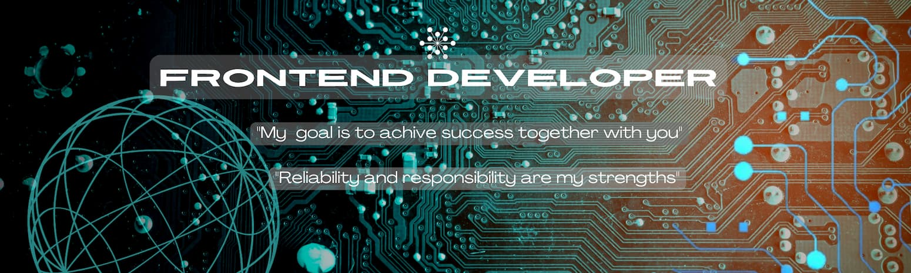

    

    

        
        
Right now

    

   

## 💫 About me:

_Hello!_ _My name is Olena._ _I am a Junior Frontend Developer with solid knowledge of_ HTML, CSS, JavaScript, React,Redux Toolkit,TypeScript.   _I have experience with technologies like_ Next.js. Express.js, Node.js, Firebase, MUI, Tailwind,CSS3, Grid   _Continuonusly learning and expanding my technical stack._

### 🛠️ Languages and Tools :

                  

### 📧 Reach me out:

### 📶 GitHub stats:

    
    

 

<!--  

 
 -->
