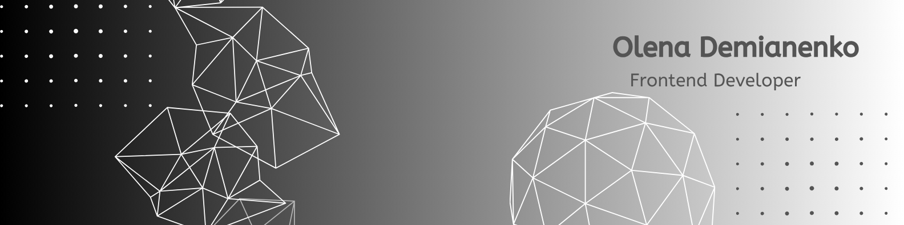

    

### 💫 _About me_:

_Hello!_ _My name is Olena._ _I am a Junior <strong>Frontend Developer</strong> with solid knowledge of_ <strong> HTML, CSS, MUI, Tailwind, JavaScript, React, Redux, Vue.js, TypeScript</strong>  
_I have experience with technologies like_
<strong> Next.js. Express.js, Mongodb, SQL, Node.js, Firebase, CSS3, SaaS, Grid, GSAP.</strong>   _I am constantly enhancing my experience and exploring new technologies._

### 🛠️ _Languages and Tools_ :

 
 
 

 
 
 
 
 

 

 
 
 
 

### 📧 _Reach me out_:

### 📶 _GitHub stats_:

### 📶 _GitHub stats_:

